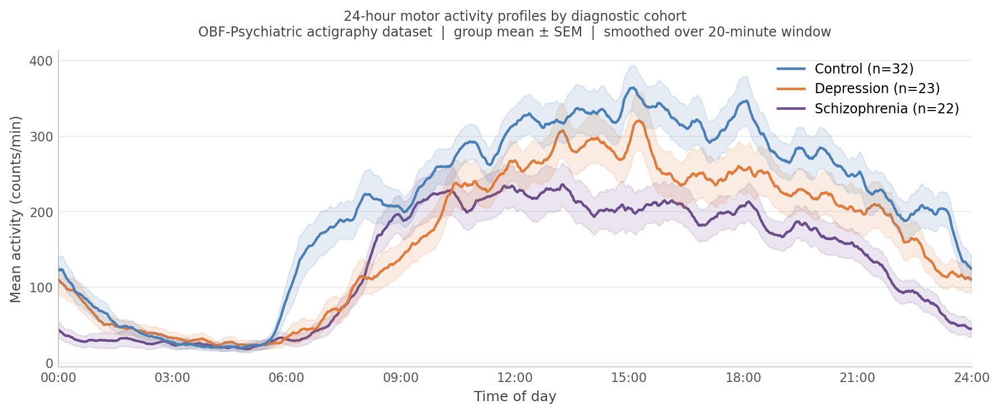
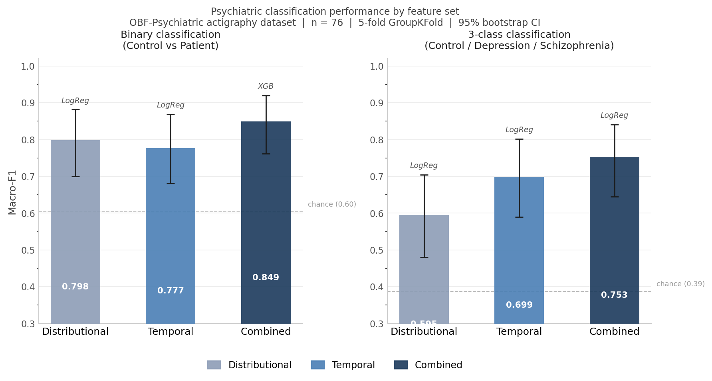
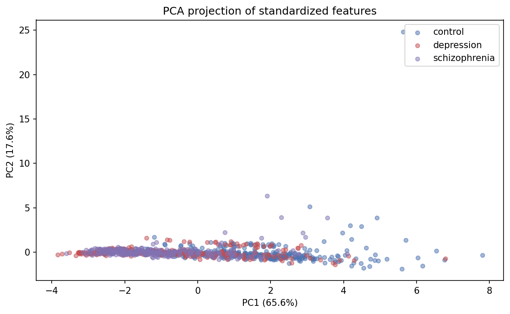
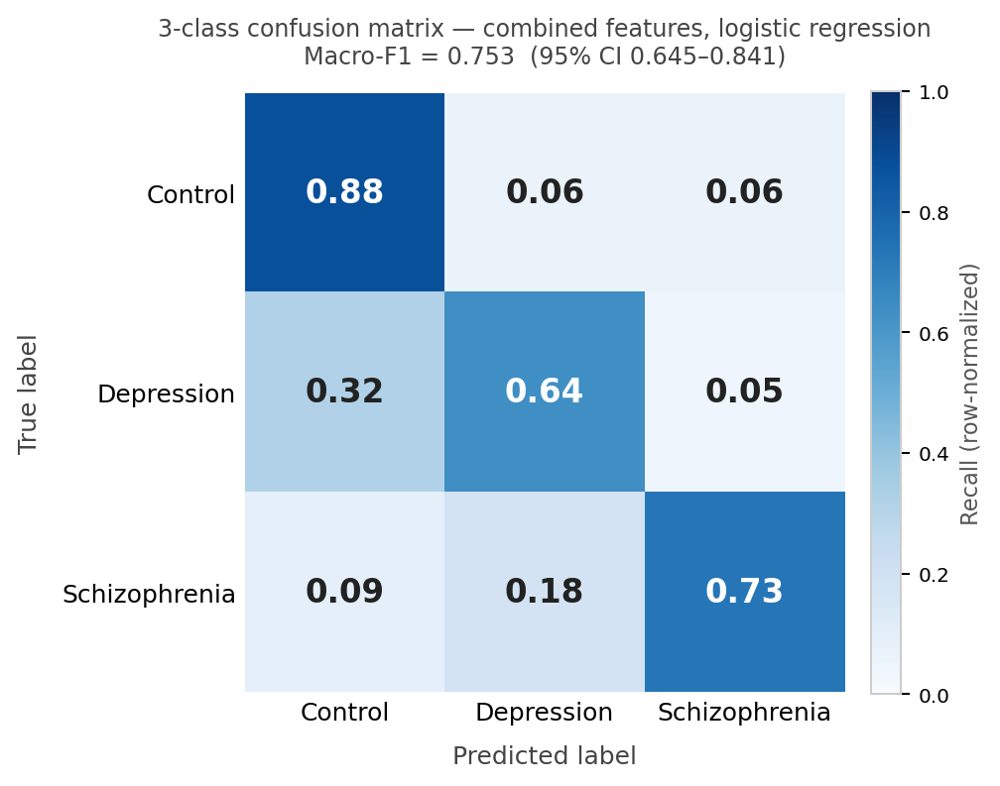
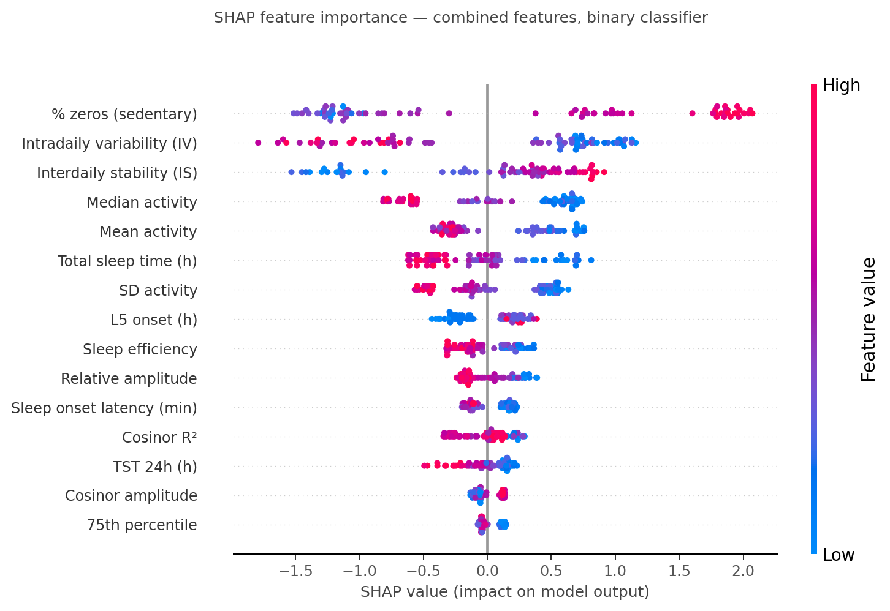
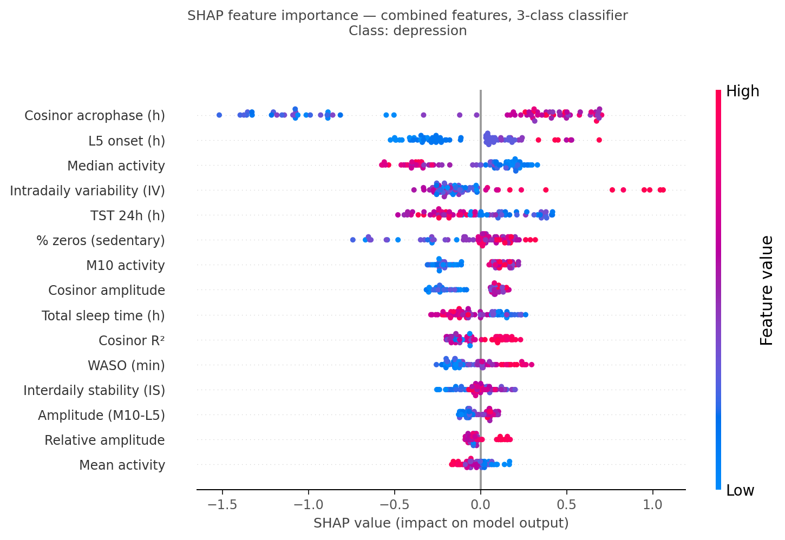
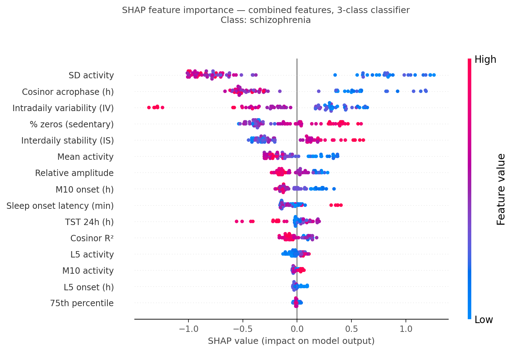

# obf-psychiatric-pipeline

> Reproducible classification of psychiatric conditions from wrist-worn
> motor activity, applying the same pipeline philosophy as my
> [RNA-seq pipeline](https://github.com/arash-rahmani/rnaseq-python-pipeline)
> to a fundamentally different data domain: from genome to behavior.

**Language:** Python 3.11 &nbsp;|&nbsp;
**Dataset:** OBF-Psychiatric (Garcia-Ceja et al., 2024) &nbsp;|&nbsp;
**Models:** logistic regression (primary), XGBoost (SHAP), dummy baseline &nbsp;|&nbsp;
**Tests:** 160 passing (pytest)

---

## Headline finding

Wrist-worn motor activity distinguishes psychiatric inpatients from
healthy controls and, when enriched with temporal and circadian
features, meaningfully separates depression from schizophrenia.

**Distributional features only (baseline):** binary F1 0.768 (0.758–0.778),
3-class F1 0.582 (0.571–0.593).

**Combined features (distributional + temporal + circadian):**
binary F1 **0.808** (0.798–0.818), 3-class F1 **0.691** (0.678–0.704).

All figures are means across 20 repeated 5-fold CV runs (seeds 0–19,
fold assignments committed in `config/folds_repeated/folds_n5_r20.json`);
intervals are 95% t-intervals on the mean across repetitions, measuring
fold-assignment stability. Bootstrap CIs quantifying sample-size
uncertainty at n=76 are reported in the Results section below.

The paired difference for the 3-class task (combined minus distributional)
is **+0.109** (95% CI [0.097–0.121]), positive in **20 of 20** repetitions.
Pairing within the same fold assignments cancels shared fold and sample
variance; 20/20 is the primary evidence for the feature engineering claim.

Combined features also clear the stratified dummy (chance) floor in all
20 of 20 repetitions: paired gain over the dummy is +0.325 on binary
(95% CI 0.308–0.343) and +0.425 on 3-class (95% CI 0.407–0.443).

The +0.109 gain on the 3-class task is driven by temporal features
(interdaily stability, intradaily variability, cosinor acrophase, and
sleep metrics) that carry disorder-specific circadian signatures not
captured by activity volume alone. Temporal features alone outperform
distributional features alone on 3-class (F1 0.644 vs 0.582, 19/20 reps):
*the feature engineering choice moved the needle, not model complexity.*

The binary and 3-class results dissociate. On 2-class, temporal features
alone (0.760) perform no better than distributional (0.768), positive in
only 8 of 20 repetitions. On 3-class, temporal alone (0.644) outperforms
distributional (0.582) in 19 of 20 repetitions. Activity volume separates
patients from controls. Circadian timing separates disorders from each other.



> Mean 24-hour activity profiles for controls, depression, and schizophrenia.
> Both patient cohorts show attenuated amplitude and a flattened rhythm
> relative to controls; the depression cohort shows a visually delayed
> acrophase that the schizophrenia cohort does not.

> Profiles use all 77 raw actigraphy participants; one participant excluded
> from classification for fewer than 7 recording days. Depression and
> schizophrenia cohorts derive from separate source studies (Depresjon and
> Psykose) with different recording protocols.

**Per-participant results (20-rep repeated 5-fold CV, logistic regression):**

| Task | Feature set | Mean F1 | 95% CI (rep) | Reps positive |
|---|---|---|---|---|
| Control vs Patient | Chance (stratified dummy) | 0.483 | 0.470–0.496 | — |
| Control vs Patient | Distributional | 0.768 | 0.758–0.778 | ref |
| Control vs Patient | **Combined** | **0.808** | **0.798–0.818** | 18/20 |
| Control vs Depr vs Schiz | Chance (stratified dummy) | 0.266 | 0.250–0.281 | — |
| Control vs Depr vs Schiz | Distributional | 0.582 | 0.571–0.593 | ref |
| Control vs Depr vs Schiz | Temporal only | 0.644 | 0.627–0.661 | 19/20 |
| Control vs Depr vs Schiz | **Combined** | **0.691** | **0.678–0.704** | 20/20 |

95% CI: t-interval on the mean across 20 repetitions (fold-assignment
stability; not sample-size uncertainty, which is characterised by
bootstrap CIs in the Results section). Reps positive: fraction of 20
paired repetitions in which the feature set outperformed distributional.
Chance row (—): combined-vs-dummy paired margins are +0.325 (binary,
95% CI 0.308–0.343) and +0.425 (3-class, 95% CI 0.407–0.443),
each in 20 of 20 repetitions.



> Distributional, temporal-only, and combined feature sets compared
> across both tasks (20-rep repeated CV means; error bars are 95%
> t-intervals on the mean across repetitions). The 3-class gain from
> distributional to combined (+0.109, 20/20 reps) is the headline result;
> the binary gain (+0.040, 18/20 reps) is real but smaller. On the binary
> task, temporal features alone match distributional; on the 3-class task,
> temporal alone outperforms distributional. Circadian structure is
> disorder-specific, not patient-specific.



> PC1 (65.6%) captures overall activity level and creates a class
> gradient. PC2 (17.6%) does not separate cohorts. The geometry is
> nearly one-dimensional on distributional features alone; temporal
> features add dimensions that separate the patient cohorts.

---

## What this pipeline does

This pipeline takes wrist-worn motor activity data from psychiatric
inpatients and healthy controls, and runs an honest, reproducible
classification analysis that respects the structure of the data:

- **Dual task framing:** both 3-class (control / depression /
  schizophrenia) and 2-class (control / patient). The contrast between
  the two is the finding.
- **Dual aggregation:** both per-day and per-participant
  classification, with participant-level cross-validation in both cases
  to prevent within-subject leakage.
- **Three classifiers:** stratified dummy (floor), logistic regression
  (interpretable linear baseline, primary), XGBoost (non-linear, used
  for SHAP interpretability). All compared fairly on identical folds.
- **Bootstrap 95% CIs on every metric:** point estimates lie when
  n=76; intervals are honest.
- **Temporal and circadian feature extraction:** interdaily stability
  (IS), intradaily variability (IV), L5/M10 rest-activity windows,
  cosinor parameters (mesor, amplitude, acrophase, R²), and Cole-Kripke
  sleep metrics (TST, WASO, sleep efficiency, SOL) computed from raw
  per-minute actigraphy.
- **SHAP-based feature attribution** on the non-linear model.
- **Config-driven, schema-validated, pytest-tested:** same
  architectural philosophy as my RNA-seq pipeline.

---

## Pipeline overview

```
Raw per-minute actigraphy (Depresjon / Psykose)
                 │
                 ▼
        Schema-validated raw loader
                 │
                 ▼
   Temporal feature extraction (17 features per participant)
   • IS, IV, L5, M10, amplitude, relative amplitude
   • Cosinor: mesor, amplitude, acrophase, R²
   • Sleep: TST, WASO, sleep efficiency, SOL
                 │
                 ▼
Raw OBF metadata (5 cohorts) + features.csv (3 cohorts)
                 │
                 ▼
   Schema-validated loader + preprocessing
   • drop participants with < 7 recording days
   • drop q25 (uninformative; saturates at zero)
                 │
                 ▼
   Join distributional + temporal on participant ID
                 │
                 ▼
   Participant-level repeated 5-fold CV
   (20 repetitions, committed fold fixtures, seeds 0–19)
                 │
   ┌─────────────┴─────────────┐
   ▼                           ▼
 Track A: 3-class            Track B: 2-class
 (control/depr/schiz)        (control vs patient)
   │                           │
   ▼                           ▼
   Dummy (floor) ‖ LogReg (primary) ‖ XGBoost (SHAP only)
   │                           │
   ▼                           ▼
   Macro-F1, per-class metrics, confusion matrices,
   SHAP attribution, rep-stability + bootstrap 95% CIs
```

---

## Repository structure

```
src/obf_psychiatric_pipeline/   # importable Python package
  config.py                     # YAML config loader, frozen dataclass
  data/
    loader.py                   # schema-validated loaders (features.csv)
    raw_loader.py               # raw per-minute actigraphy loader
    preprocess.py               # min-days filter, feature exclusion
    split.py                    # participant-level GroupKFold (per-day flow)
  cv/
    folds.py                    # committed fold fixture generation and I/O
    runner.py                   # repeated CV evaluation and statistics
  features/
    _helpers.py                 # shared private helpers
    temporal.py                 # IS, IV, L5, M10
    cosinor.py                  # cosinor model parameters
    sleep.py                    # Cole-Kripke scorer + sleep metrics
    derived.py                  # amplitude, relative amplitude
    extract.py                  # per-participant feature orchestrator
  models/
    classifiers.py              # estimator factories
    aggregate.py                # per-day -> per-participant
    relabel.py                  # 3-class -> 2-class
    evaluate.py                 # metrics + bootstrap CIs
    train.py                    # experiment grid
  viz/
    eda.py                      # EDA plots
config/
  config.yaml                   # paths, split seed, exclusions
  folds_repeated/               # committed 20-rep fold fixtures
scripts/                        # CLI entry points (see Quickstart)
tests/                          # 160 pytest tests
figures/                        # committed canonical figures
results/                        # generated scratch outputs (gitignored)
data/                           # input data (gitignored)
```

---

## Quickstart

**Requirements:** Python 3.11 (tested on Linux and Windows)

```bash
git clone https://github.com/arash-rahmani/obf-psychiatric-pipeline
cd obf-psychiatric-pipeline
python -m venv .venv
source .venv/bin/activate          # Linux/macOS
# .\.venv\Scripts\Activate.ps1     # Windows PowerShell
pip install -U pip
pip install -e .
```

Place the OBF-Psychiatric CSVs in `data/raw/` (six files: five
`*info.csv` and `features.csv`). Place raw per-minute actigraphy in
`data/raw/actigraphy/{control,depression,schizophrenia}/`.

```bash
python scripts/load_data.py                    # smoke test: load and validate
python scripts/run_eda.py                       # EDA plots (scratch -> results/eda)
python scripts/generate_fold_fixtures.py        # write committed 20-rep fold fixtures
python scripts/run_repeated_cv.py               # canonical 20-rep repeated CV results
python scripts/plot_repeated_cv_comparison.py   # performance comparison figure
python scripts/plot_confusion_from_fixture.py   # 3-class confusion matrix
python scripts/plot_shap_combined.py            # SHAP attribution figures
python scripts/plot_circadian_profiles.py       # circadian activity profiles
pytest                                          # 160 passed, 6 skipped
```

The headline numbers reproduce on any platform because the fold
assignments are committed fixtures (`config/folds_repeated/folds_n5_r20.json`),
not generated at runtime. Plot scripts write into `results/figures/`
(scratch, gitignored); the curated figures committed in `figures/` are
the canonical versions referenced above and in the manuscript.

---

## Key design decisions

**Why dual task framing (3-class and 2-class)?**
Exploratory PCA showed that depression and schizophrenia largely
overlap in distributional feature space while both separate cleanly
from controls. Reporting only the 3-class result would have hidden the
actual structure of the data. Reporting both, and the gap between them,
makes the finding visible. The gap narrows substantially with temporal
features (+0.109 on 3-class vs +0.040 on 2-class, 20-rep repeated CV).

**Why participant-level splitting, not row-level?**
Each participant contributes ~12 rows (one per recording day). Random
row-level splitting puts the same participant in both train and test,
which inflates measured performance via subject-identity leakage. This
is the most common methodological error in actigraphy-based
classification literature. Participant-level folds enforce that no
participant appears in both train and test of any fold.

**Why both per-day and per-participant aggregation?**
Per-day uses more data (~880 samples) but day-rows from the same
person are not independent; confidence intervals computed on per-day
data are artificially tight. Per-participant aggregation (~76 samples)
respects the true unit of clinical inference and gives honest CIs.
Both are reported; the per-participant numbers are the ones to trust.

**Why temporal features at participant level only?**
IS, IV, L5/M10, cosinor, and sleep metrics are inherently multi-day
aggregates that characterise a participant's rhythm over the full
recording, not a single day. Computing them at the day level would be
methodologically incoherent. This is also why they most directly address
the 3-class problem: they capture rhythm structure, not daily volume.

**Why logistic regression as the primary classifier?**
When logreg matches XGBoost, the problem is near-linear and model
complexity is not the path to better performance; feature engineering
is. That prediction shaped Phase 2: temporal features pushed 3-class
F1 from 0.582 to 0.691 (logreg, 20-rep repeated CV). XGBoost is retained
only for SHAP-based interpretability and does not enter the performance
headline; its cross-platform floating-point behaviour is not
deterministic, so the repeated-CV performance claim uses logistic
regression exclusively, the more conservative and reproducible choice.

**Why no hyperparameter tuning?**
With 22 participants in the smallest cohort, nested CV hyperparameter
search is mostly noise. Default sklearn / XGBoost hyperparameters were
used (XGBoost: `n_estimators=200, max_depth=4, learning_rate=0.05`,
logreg: `C=1.0`, both with `class_weight="balanced"`). The focus of
this work is methodological framing and feature engineering, not
hyperparameter optimization.

**Why bootstrap confidence intervals?**
At n=76 participants, point estimates of macro-F1 are unstable across
resampling. The bootstrap CI honestly reflects how much uncertainty
remains in the headline number.

---

## Findings

**1. Combined features substantially improve 3-class discrimination.**
Distributional-only 3-class F1 was 0.582 (20-rep mean). Temporal
features alone reach 0.644. Combined features reach 0.691. The paired
difference (combined minus distributional) is +0.109 (95% CI
[0.097–0.121]), positive in 20 of 20 repetitions. The paired comparison
cancels shared fold variance; unanimity across repetitions is the
robust evidence, not point-estimate magnitude.



> The 3-class classifier separates controls from both patient cohorts
> with reasonable reliability. Depression and schizophrenia still
> confuse each other in both directions; the residual overlap is
> the honest upper bound of what combined features can resolve at
> this sample size. Shown for one representative fold (repetition 0,
> fold 0 of committed fixture `folds_n5_r20.json`); pattern is
> consistent across folds.

**2. Temporal features alone outperform distributional features alone
on the 3-class problem.**
F1 0.644 vs 0.582 (19/20 reps positive) with logistic regression.
Circadian structure carries disorder-specific information that activity
volume statistics do not. Sleep fragmentation, reduced interdaily
stability, and shifted acrophase differentiate the patient cohorts in
ways that mean activity level cannot.

**3. Feature engineering, not model complexity, was the lever.**
Logistic regression on distributional features was already near-linear;
adding temporal features pushed 3-class F1 from 0.582 to 0.691 with the
same classifier. The lever was the feature set, not the model. This is
also visible in the dissociation: temporal features help specifically
where the problem is disorder discrimination, and not where it is
illness detection.

**4. The binary and 3-class tasks dissociate on temporal features.**
On 2-class (control vs patient), temporal features alone (0.760)
perform no better than distributional features (0.768), positive in
only 8 of 20 repetitions. On 3-class, temporal alone (0.644) outperforms
distributional (0.582) in 19 of 20 repetitions. Activity volume separates
patients from controls. Circadian timing separates disorders from each
other. This dissociation is mechanistically coherent with the acrophase
finding: timing is disorder-specific signal, not patient-specific signal.

**5. One pre-computed feature carries no signal.**
The 25th percentile of per-minute activity (`q25`) saturates at zero
across all classes; every participant spends substantial time
motionless during sleep, regardless of diagnosis. Excluded from
modeling.

**6. Confidence intervals widen honestly with proper aggregation.**
Per-day CIs were ~0.06 wide; per-participant CIs were ~0.18 wide for
the same metric. The wider intervals are the honest ones.

### Mechanistic interpretation

SHAP attribution on the combined-feature XGBoost model (n=76, full
dataset) identifies which features drive each classification decision
and in which direction. Three results stand out.

**Depression.** Cosinor acrophase is the dominant feature. Low acrophase
values carry strongly negative SHAP for the depression class: a delayed
activity peak is the primary signal pushing a participant toward a
depression prediction. L5 onset ranks second, independently flagging
delayed sleep onset as corroborating evidence. Together, these two
features recover the textbook delayed circadian phase finding in MDD
from actigraphy alone, without any clinical annotation.

**Schizophrenia.** Activity standard deviation dominates: low SD pushes
strongly toward schizophrenia, consistent with antipsychotic motor
suppression flattening the behavioral repertoire. Cosinor acrophase
enters in the opposite direction from depression: an earlier activity
peak predicts schizophrenia rather than depression. This confirms
that the two disorders carry distinct circadian signatures even when
their gross activity levels overlap.

**Binary (control vs patient).** Percentage of zeros (sedentary time),
intradaily variability, and interdaily stability lead the ranking.
Temporal features place alongside distributional ones, confirming that
circadian structure contributes independent signal beyond overall
activity level.







> SHAP attributions computed by training XGBoost on full dataset (n=76)
> for interpretability purposes only. Classification performance metrics
> derive from held-out 20-repetition 5-fold cross-validation.

---

## Limitations

- **Sample size: n = 76 participants** (after preprocessing; 77 in
  raw data). Bootstrap CIs reflect this; readers should weight point
  estimates accordingly.
- **Inpatient cohorts on medication.** Both patient groups were
  recorded during inpatient stays. Antipsychotic and antidepressant
  medications have known motor effects. Results characterise "psychiatric
  inpatient on medication" as much as "depression" or "schizophrenia"
  per se, and do not generalise to outpatient or unmedicated populations.
- **Cole-Kripke device mismatch.** Sleep scoring was validated on AMI
  Motionlogger hardware; OBF uses Actiwatch. Absolute sleep-minute
  accuracy is reduced, but group separation survives because
  miscalibration affects all cohorts uniformly.
- **No external validation.** All performance numbers come from
  cross-validation on a single dataset. Generalisation to other
  actigraphy datasets is untested.
- **The OBF-Psychiatric dataset combines two earlier studies**
  (Depresjon and Psykose) with different recording protocols. Some
  cross-cohort confounds may reflect study-of-origin rather than
  diagnosis.

---

## Next work

This pipeline is the basis for a paper in preparation, targeting
*npj Digital Medicine*. The analysis reported here is complete.

The canonical numbers (0.691 / 0.644 / 0.582 on 3-class, 0.808 / 0.768
on 2-class, paired difference +0.109 [0.097–0.121] at 20/20; stratified
dummy floor 0.266 / 0.483) derive from
20-rep repeated 5-fold CV with committed fold fixtures. They are the
numbers for the draft.

The methodological backbone established here covers schema-validated
loading, participant-level CV, bootstrap-CI'd evaluation, dual task
framing, repeated CV with committed fixtures, and SHAP attribution. It
transfers directly to the open question this work cannot yet answer:
whether these findings replicate on independent actigraphy datasets
collected outside the OBF-Psychiatric cohort. External validation is
the natural next step.

---

## Citation

Data: Enrique Garcia-Ceja, Andrea Stautland, Michael A. Riegler, Pål
Halvorsen, Salvador Hinojosa, Gilberto Ochoa-Ruiz, Ketil Joachim
Oedegaard, and Petter Jakobsen. *OBF-Psychiatric, a motor activity
dataset of depressed, schizophrenic, and attention deficit
hyperactivity disorder patients*, 2024.

---

## About

Built by [Arash Rahmani](https://github.com/arash-rahmani), M.Sc.
Bioinformatics, Julius-Maximilians-Universität Würzburg.

This is the second in a series of reproducible analysis pipelines
spanning biological and behavioral data:

- **[rnaseq-python-pipeline](https://github.com/arash-rahmani/rnaseq-python-pipeline):** RNA-seq differential expression and pathway enrichment
- **obf-psychiatric-pipeline:** motor-activity classification of psychiatric conditions *(this repo)*

The same architectural principles apply across both: config-driven,
schema-validated, pytest-tested, modular. The data domain shifts
from genome to mind; the rigor doesn't.

[LinkedIn](https://linkedin.com/in/arash-rahmani-544684242)
